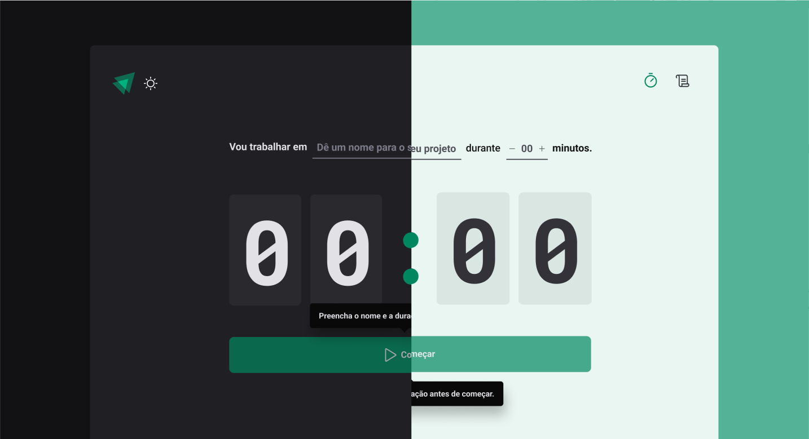

<h1 align=center>Ignite timer</h1>



## Techs

- `React`
- `vite`
- `react-router-dom`
- `styled-components`
- `react-hook-form`
- `date-fns`
- `React`
- `typescript`

## Features

- `Start new cycle`
- `Finish current cycle`
- `Interrupt current cycle`
- `Save current cycle`
- `Save history`
- `List cycle history`
- `Toggle app theme`

## how to contribute

1. fork this project the project and then

```bash
# clone the github repo
git clone my-fork-url

# go to the project dir
cd ignite-timer

# install dependencies
yarn # or npm i

# start the dev server
yarn dev
```
2. Make your changes

3. Commit and push

```bash
# commit your changes
git add . && git commit -m 'feat(myfeature): my cool feature!'

# push your changes
git push origin my-fork
```

4. And open a pull request for me :)
